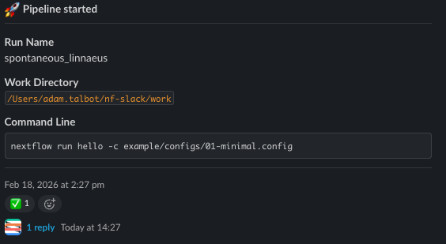
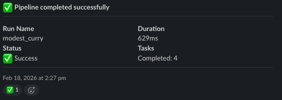
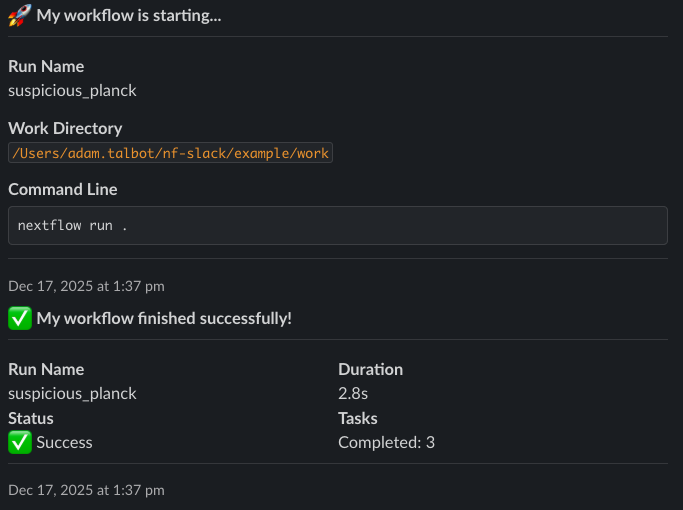
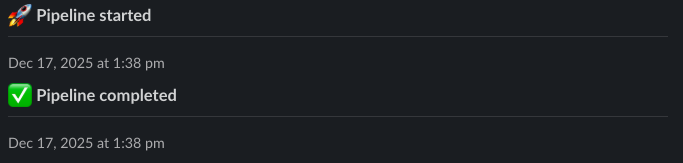
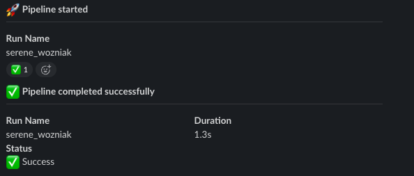

# Examples

Complete, runnable examples that demonstrate nf-slack features. Each example can be run directly from the `example/` directory.

!!! tip "Running Examples"
All config examples can be run with:
`bash
    nextflow run main.nf -c configs/<example>.config
    `
Script examples run directly:
`bash
    nextflow run scripts/<example>.nf -c configs/01-minimal.config
    `

---

## Configuration Examples

### Minimal Setup

The simplest possible configuration — a bot token, channel, and defaults:

```groovy title="example/configs/01-minimal.config"
plugins {
    id 'nf-slack'
}

slack {
    enabled = true
    bot {
        token = System.getenv("SLACK_BOT_TOKEN")
        channel = System.getenv("SLACK_CHANNEL_ID")
    }
}
```

You'll receive start, complete, and error notifications with default formatting.



---

### Notification Control

Choose which events trigger notifications:

```groovy title="example/configs/02-notification-control.config"
plugins {
    id 'nf-slack'
}

slack {
    enabled = true
    bot {
        token = System.getenv("SLACK_BOT_TOKEN")
        channel = System.getenv("SLACK_CHANNEL_ID")
    }

    onStart.enabled = false
    onComplete.enabled = true
    onError.enabled = true
}
```



---

### Custom Message Text

Personalize your notification messages:

```groovy title="example/configs/03-message-text.config"
plugins {
    id 'nf-slack'
}

slack {
    enabled = true
    bot {
        token = System.getenv("SLACK_BOT_TOKEN")
        channel = System.getenv("SLACK_CHANNEL_ID")
    }

    onStart {
        message = '🚀 *My workflow is starting...*'
    }

    onComplete {
        message = '✅ *My workflow finished successfully!*'
    }

    onError {
        message = '❌ *My workflow failed!*'
    }
}
```



---

### Colors and Custom Fields

Use map-format messages for colors and additional fields:

```groovy title="example/configs/04-custom-fields.config"
plugins {
    id 'nf-slack'
}

slack {
    enabled = true
    bot {
        token = System.getenv("SLACK_BOT_TOKEN")
        channel = 'general'
    }

    onStart {
        message = [
            text: '🚀 *Pipeline Starting*',
            color: '#3AA3E3',
            customFields: [
                [title: 'Priority', value: 'High', short: true],
                [title: 'Team', value: 'Bioinformatics', short: true],
                [title: 'Notes', value: 'Scheduled run for weekly analysis']
            ]
        ]
    }

    onComplete {
        message = [
            text: '✅ *Pipeline Complete*',
            color: '#2EB887',
            customFields: [
                [title: 'Status', value: 'All samples processed', short: true],
                [title: 'Quality', value: 'PASS', short: true]
            ]
        ]
    }

    onError {
        message = [
            text: '❌ *Pipeline Failed*',
            color: '#A30200',
            customFields: [
                [title: 'Support Contact', value: '#help-pipelines', short: true],
                [title: 'Action', value: 'Check logs and retry', short: true]
            ]
        ]
    }
}
```



---

### Selective Workflow Fields

Control which workflow metadata fields appear in notifications:

```groovy title="example/configs/05-selective-fields.config"
plugins {
    id 'nf-slack'
}

slack {
    enabled = true
    bot {
        token = System.getenv("SLACK_BOT_TOKEN")
        channel = System.getenv("SLACK_CHANNEL_ID")
    }

    onStart {
        includeFields = ['runName', 'status']
    }

    onComplete {
        includeFields = ['runName', 'duration', 'status']
    }

    onError {
        includeFields = ['runName', 'duration', 'errorMessage', 'failedProcess']
    }
}
```



---

### Threaded Messages

By default, all notifications are sent in a single thread. This can be disabled to post each message separately:

```groovy title="example/configs/06-threaded-messages.config"
plugins {
    id 'nf-slack'
}

slack {
    enabled = true

    bot {
        token = System.getenv("SLACK_BOT_TOKEN")
        channel = 'general'
    }
    useThreads = false
}
```

All messages are posted to the channel as separate messages.

---

### File Uploads

Upload files to Slack on pipeline completion:

```groovy title="example/configs/07-file-upload.config"
plugins {
    id 'nf-slack'
}

slack {
    enabled = true
    bot {
        token = System.getenv("SLACK_BOT_TOKEN")
        channel = System.getenv("SLACK_CHANNEL_ID")
    }

    onComplete {
        files = ['results/multiqc_report.html', 'results/pipeline_report.html']
    }

    onError {
        files = ['results/pipeline_report.html']
    }
}
```

---

## Script Examples

### Send Messages from Workflow Code

```groovy title="example/scripts/01-message-in-workflow.nf"
include { slackMessage } from 'plugin/nf-slack'

process HELLO {
    input:
    val sample_id

    output:
    val sample_id

    script:
    """
    echo "Processing ${sample_id}"
    """
}

workflow {
    samples = Channel.of('sample1', 'sample2', 'sample3')
    HELLO(samples)

    slackMessage([
        message: '📊 *Pipeline Progress Update*',
        fields: [
            [title: 'Status', value: 'Processing started', short: true],
            [title: 'Samples', value: '3 samples queued', short: true]
        ]
    ])
}
```

---

### Conditional Notifications on Completion

```groovy title="example/scripts/02-message-on-complete.nf"
include { slackMessage } from 'plugin/nf-slack'

process HELLO {
    input:
    val sample_id

    output:
    val sample_id

    script:
    """
    echo "Processing ${sample_id}"
    """
}

workflow {
    samples = Channel.of('sample1', 'sample2', 'sample3')
    HELLO(samples)
}

workflow.onComplete {
    def status = workflow.success ? '✅ Success' : '❌ Failed'
    slackMessage([
        message: "*Pipeline ${status}*",
        fields: [
            [title: 'Duration', value: "${workflow.duration}", short: true]
        ]
    ])
}
```

---

### Upload Files from Workflow Code

```groovy title="example/scripts/03-file-upload.nf"
include { slackFileUpload } from 'plugin/nf-slack'

process GENERATE_REPORT {
    output:
    path 'qc_summary.csv'

    script:
    """
    echo "sample,reads,quality" > qc_summary.csv
    echo "sample1,1000000,38.5" >> qc_summary.csv
    echo "sample2,1200000,39.1" >> qc_summary.csv
    echo "sample3,950000,37.8" >> qc_summary.csv
    """
}

workflow {
    report = GENERATE_REPORT()

    // Simple upload
    report | map { slackFileUpload(file: it) }

    // Upload with metadata
    report | map {
        slackFileUpload(
            file: it,
            title: 'QC Summary Report',
            comment: 'Automatically generated QC metrics'
        )
    }
}
```

---

## What's Next?

- **[Usage Guide](../usage/guide.md)** — All configuration options explained
- **[API Reference](../reference/api.md)** — Complete property and function reference
