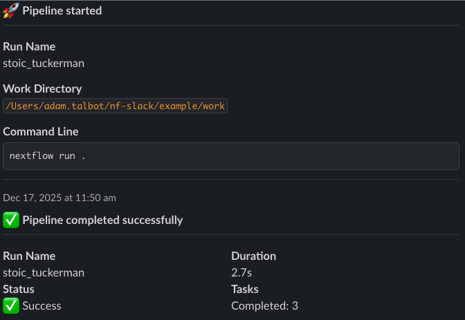
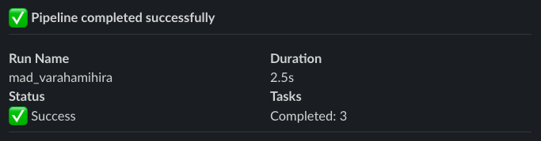

# Automatic Notifications

Once configured, nf-slack automatically sends notifications for workflow events. No code changes needed!

## Default Behavior

By default, nf-slack sends notifications for three workflow events:

- 🚀 **Workflow Start** - When your pipeline begins execution
- ✅ **Workflow Complete** - When your pipeline finishes successfully
- ❌ **Workflow Error** - When your pipeline encounters an error



## Notification Content

### Workflow Start

When a workflow starts, the notification includes:

- Run name
- Session ID
- Command line used to launch the workflow
- Work directory path
- Timestamp


### Workflow Complete

When a workflow completes successfully, the notification includes:

- Run name
- Duration (total execution time)
- Task counts (succeeded, cached, failed)
- Resource usage summary
- Timestamp

### Workflow Error

When a workflow fails, the notification includes:

- Run name
- Error message
- Failed process name
- Command line
- Work directory
- Timestamp

## Controlling Notifications

### Enable/Disable All Notifications

```groovy
slack {
    enabled = true  // Set to false to disable all notifications
    bot {
        token = System.getenv('SLACK_BOT_TOKEN')
        channel = 'general'
    }
}
```

### Enable/Disable Specific Events

Control which events trigger notifications:

```groovy
slack {
    bot {
        token = System.getenv('SLACK_BOT_TOKEN')
        channel = 'general'
    }

    onStart.enabled = false     // Don't notify on start
    onComplete.enabled = true   // Notify on completion
    onError.enabled = true      // Notify on errors
}
```



### Common Notification Patterns

#### Errors Only

Only get notified when something goes wrong:

```groovy
slack {
    bot {
        token = System.getenv('SLACK_BOT_TOKEN')
        channel = 'general'
    }

    onStart.enabled = false
    onComplete.enabled = false
    onError.enabled = true
}
```

#### Start and Error Only

Get notified when pipelines start and if they fail:

```groovy
slack {
    bot {
        token = System.getenv('SLACK_BOT_TOKEN')
        channel = 'general'
    }

    onStart.enabled = true
    onComplete.enabled = false
    onError.enabled = true
}
```

#### Development Mode (Quiet)

Disable all automatic notifications during development:

```groovy
slack {
    bot {
        token = System.getenv('SLACK_BOT_TOKEN')
        channel = 'general'
    }

    onStart.enabled = false
    onComplete.enabled = false
    onError.enabled = false
}
```

!!! note

    Even with automatic notifications disabled, you can still send [custom messages](custom-messages.md) from your workflow.

## Notification Format

All automatic messages use Slack's attachment format with Block Kit elements:

- **Workflow Start**: Blue color (`#3AA3E3`)
- **Workflow Complete**: Green color (`#2EB887`)
- **Workflow Error**: Red color (`#A30301`)

Each message includes:

- Workflow name as the author
- Nextflow icon
- Timestamp footer
- Configurable bot username and icon (see [Configuration](configuration.md))

## Advanced Configuration

For advanced customization options, see:

- [Custom Messages](custom-messages.md) - Send messages from your workflow
- [Configuration](configuration.md) - Advanced configuration options
- [API Reference](../reference/api.md) - Complete configuration reference

## Next Steps

- Learn how to [send custom messages](custom-messages.md) from your workflow
- Explore [configuration options](configuration.md) to customize notifications
- View [examples](../examples/gallery.md) for real-world use cases
